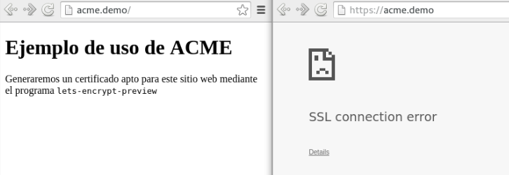
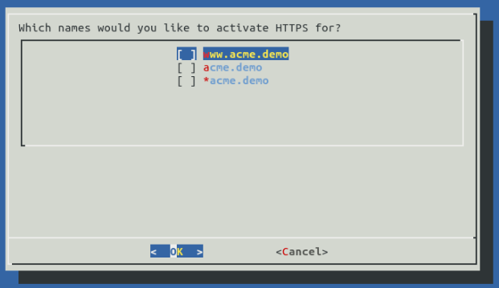

# Introducción

Desde hace unos años, Internet se ha convertido en el instrumento de comunicación más grande y que más rápida
difusión permite del mundo. El comportamiento de los usuarios en la web de la actualidad difiere enormemente de 
aquel de los inicios de la web. Hoy se pasa gran parte del tiempo de navegación en aplicaciones web, en lugar de 
simples sitios web estáticos, basta observar un ranking de sitios web reputado como el de Alexa [@alexa500] para
comprobarlo. Estas aplicaciones interactúan con el usuario, en el sentido de que intercambian datos 
con él más allá de la simple carga de una página web: el usuario puede enviar mensajes, subir archivos, jugar, y
realizar cualquier otro tipo de intercambio de información. Esto implica mayor flujo de datos durante la comunicación y mayor
necesidad de procesamiento en el servidor.

Además, la comunicación en Internet no supone únicamente navegación web, sino también prácticamente cualquier
servicio remoto que utilice una arquitectura cliente-servidor. Esto es, las aplicaciones móviles que permiten
el acceso a servicios sociales, de búsqueda, de mensajería, de mapas, etc. utilizan los mismos protocolos básicos
que un navegador web para transmitir y recibir los datos necesarios. 

## Seguridad en la red

El protocolo de aplicación más extendido para la comunicación en Internet, tanto para la web como para aplicaciones nativas, es
HTTP (*HyperText Transfer Protocol*). Se trata de un protocolo orientado a texto basado en el intercambio de
mensajes entre cliente y servidor con palabras clave que simbolizan métodos y estados [@tanenbaum]. Este protocolo
no incluye por defecto ninguna medida de seguridad en cuanto a confidencialidad y autenticación. Para ello, es necesario
utilizar un protocolo de cifrado, TLS (*Transport Layer Security*), en la capa de aplicación, por debajo de HTTP.

TLS está definido en [@tlsrfc], y proporciona la posibilidad de autenticar la comunicación: por ejemplo, al acceder
a `https://github.com` se verifica que quien está respondiendo es efectivamente GitHub, como se muestra en la Figura 
\ref{httpsgithub}. TLS también ofrece la capacidad de cifrar la transmisión,
de forma que ningún posible atacante pueda visualizar la información que se está enviando y recibiendo.


Para que TLS se pueda utilizar en una comunicación, es necesario que el servidor cuente con un certificado de tipo
X.509v3. Esta especificación define varios estándares [@x509rfc], entre ellos dicho formato de certificado.

## Problemas actuales

En general, la autenticación y cifrado mediante TLS se reserva a pocos sitios web, normalmente a las aplicaciones
web que requieren que el usuario inicie y mantenga una sesión (por lo que transmitirá datos como nombres de usuario,
email y contraseñas). Este hecho implica que los usuarios mantienen conexiones seguras con un número muy limitado
de sitios, y que en general podrán transmitir datos de cualquier tipo sin tener noción del nivel de seguridad que
están utilizando en cada momento.

Además, los certificados necesarios para realizar una conexión válida, que el navegador del usuario no detecte como 
fraudulenta, han de ser expedidos por Autoridades de Certificación (*Certificate Authorities*, CA). La propia especificación
de X.509 [@x509rfc] describe el algoritmo de verificación del camino de certificación: cuando un cliente encuentra
un certificado para el que no sabe si confiar, debe seguir el "camino" de certificados hasta uno que pertenezca a 
una CA que sí esté registrada como confiable. Este mecanismo puede restar dinamismo a la utilización de certificados,
ya que para contar con uno confiable hay que seguir la jerarquía establecida.

A continuación se estudian varios nuevos desarrollos que pretenden resolver algunos de estos problemas y se describe
su instalación y uso. El resto de este texto se organiza como sigue: en la sección \ref{http2} se introduce el protocolo
HTTP/2 y se detallan las funcionalidades que afectan a las comunicaciones seguras; en la sección \ref{letsencrypt} se
analiza la iniciativa Let's Encrypt y cómo puede colaborar a la difusión de la certificación web; finalmente en la sección
\ref{convergence} se explica la propuesta denominada Convergence para sustituir a la certificación tradicional.

# HTTP/2
\label{http2}

La versión actual de HTTP, a día de la redacción de este texto, es 1.1 [@h11rfc]. HTTP/2 es una nueva versión de este
protocolo que añade funcionalidad en lugar de reemplazarla. HTTP/2 está terminando su proceso de estandarización,
está aprobado por la Internet Engineering Task Force (IETF) [@ietfh2] y cuenta con un borrador de RFC en espera de aceptación [@h2rfc]. Este protocolo
se basa en SPDY, una propuesta de los desarrolladores de Chromium [@spdychr], y continúa incluyendo la mayoría de
funcionalidades, habiendo añadido nuevas mejoras.

En el ámbito de la seguridad, lo interesante de HTTP/2 es que pretende fomentar el uso de TLS, tratando de compensar
la latencia provocada por el cifrado y el *handshake* mediante técnicas como la compresión, *Server Push* y similares.

## Negociación de protocolo

Para mantener compatibilidad con los clientes que aún no implementen HTTP/2, se incluye una negociación del protocolo
a utilizar previa a cualquier solicitud HTTP, es decir, esto se realiza durante el *handshake* TLS (el intercambio de mensajes para
establecer la conexión cifrada), mediante una 
extensión de dicho protocolo denominada ALPN [@alpnrfc] (*Application Layer Protocol Negotiation*), que permite que el 
cliente ofrezca una lista de protocolos soportados, codificados como `http/1.1`, `spdy/3.1`, `h2`, etc. y el 
servidor responda con su elección de protocolo.

Puesto que esta negociación se realiza como parte del *handshake* TLS, es razonable pensar que el uso principal de HTTP/2
debería ser sobre TLS, es decir, en HTTP/2 se prefieren las conexiones cifradas sobre las no cifradas. Asimismo, existe
en la especificación [@h2rfc] una opción para utilizar HTTP/2 en texto plano, sin usar TLS ni ALPN, mediante el valor `h2c`
en el campo *Upgrade* de las cabeceras HTTP de la solicitud. Sin embargo, los desarrolladores de los principales navegadores
web no implementarán esta variante de HTTP/2 [@mozillah2] [@chromiumh2], forzando a utilizar siempre la conexión segura.

## Técnicas para mejora de la velocidad

HTTP/2 incorpora varias estrategias para reducir la cantidad de datos enviados en cada transmisión, de forma que aunque
se utilice el cifrado, la comunicación sea más rápida que en HTTP/1.1. Uno de los puntos principales que se ha trabajado
en SPDY y HTTP/2 es el de los *streams* o flujos, que permiten varias comunicaciones concurrentes entre un cliente y un 
servidor. Estos flujos pueden ser abiertos y cerrados por cualquiera de los dos extremos de la comunicación.

Una funcionalidad novedosa dentro de HTTP/2 es la capacidad de que el servidor se "adelante" a las peticiones del cliente
y envíe, junto con una respuesta a una solicitud, más respuestas que conoce que el cliente probablemente solicite a
continuación. Esto se denomina *Server Push*, y permite que el cliente introduzca en caché dichas respuestas y las
recupere cuando las necesite, en lugar de tener que realizar una nueva petición al servidor.

Otra de estas técnicas es la compresión HPACK para las cabeceras de HTTP, definida de forma separada en [@hpackrfc]. 
Este tipo de compresión corrige además una vulnerabilidad provocada por el uso de TLS y la compresión DEFLATE, que 
permitía que un atacante robase información cifrada, por ejemplo *cookies* de sesión [@crime].

## Cifrado oportunista

El cifrado oportunista o seguridad oportunista es un mecanismo que permite aprovechar el soporte para cifrado mediante
TLS de ambos extremos de la comunicación, aún cuando el protocolo en el que resida esta no obligue a usar cifrado. Es
decir, al entrar en un sitio web mediante `http://`, no se requerirá de cifrado ni autenticación por ninguna de las 
dos partes, pero el cifrado oportunista podrá actuar para que la transmisión de datos se realice de forma cifrada, sin
necesidad de intercambiar previamente un certificado.

Para HTTP/2 existen propuestas de cifrado oportunista como [@opsecrfc], que pese a que no prevendrían ataques activos
a la comunicación (algo que sí previene HTTP sobre TLS con autenticación), sí que dificultarían notablemente las
escuchas pasivas, es decir, la comunicación no podría ser descifrada por un tercero a no ser que este dirija un
ataque deliberado contra ella.

Si un servidor ofrece cifrado oportunista, deberá indicarlo mediante un anuncio de servicio alternativo HTTP, con el
identificador `h2`. El cliente podrá entonces enviar nuevas peticiones dirigidas al servidor pero incorporando el
cifrado, aunque sin requerir una autenticación por parte del servidor, en el caso en que se seleccione para la comunicación
un mecanismo de cifrado TLS que no necesite un certificado X.509. En ese caso, el cliente podrá más tarde dejar de realizar
peticiones cifradas si lo desea.

## HTTP/2 en Apache

Apache (o Apache HTTPD) es un conocido servidor web desarrollado por la Apache Foundation [@httpd]. Este servidor es
extensible mediante módulos, trozos de código que pueden ampliar su funcionalidad. Puesto que HTTP/2 aún no es un estándar,
el soporte en la mayoría de servidores no está aún disponible o está en fase experimental. Es el caso de Apache, donde
HTTP/2 no viene integrado, pero se puede añadir mediante un módulo en desarrollo llamado *mod_h2* [@modh2]. A continuación
se decribe el proceso de instalación de Apache con *mod_h2*.

Las órdenes de instalación se han ejecutado sobre una máquina Ubuntu 14.04, pero deberían ser adaptables a cualquier
otro sistema GNU/Linux. Se seguirán los siguientes pasos, marcados por la documentación de *mod_h2*:

\small

```bash
# Instalación de dependencias
sudo apt-get update
sudo apt-get install git gcc g++ libpcre3-dev libcunit1-dev libev-dev libjansson-dev \
  libjemalloc-dev cython make binutils autoconf automake autotools-dev libtool pkg-config \
  zlib1g-dev libssl-dev libxml2-dev libevent-dev python3.4-dev libevent-openssl-2.0-5 curl

git clone https://github.com/tatsuhiro-t/spdylay.git
cd spdylay
autoreconf -i && automake && autoconf
./configure
make
sudo make install
cd ..

# Instalación de 'mod_h2' en modo sandbox para no crear conflictos
# con posibles instalaciones de Apache
git clone https://github.com/icing/mod_h2.git
cd mod_h2
autoreconf -i && automake && autoconf
./configure --enable-sandbox
make
make install

# Configuración y ejecución de tests
sudo su -c 'echo "127.0.0.1  test.example.org" >> /etc/hosts'
make test
```

\normalsize

Tras la instalación en modo *sandbox* de *mod_h2*, se dispondrá de un servidor Apache preconfigurado, bajo la ruta 
`sandbox/install/`. Por tanto, es posible acceder a la dirección `http://test.example.org:12345`,
donde dicho servidor estará escuchando y responderá a la petición indicando que
soporta HTTP/2 en el campo *Alt-Svc* de las cabeceras, como se observa en la figura \ref{mod_h2_chromium}.

\begin{figure}[h]
\centering
\includegraphics[width=0.6\maxwidth]{img/mod_h2_chromium}
\caption{Conexión a un servidor Apache soportando HTTP/2\label{mod_h2_chromium}}
\end{figure}

El servidor también escuchará en el puerto 12346, accesible desde `https://` para establecer una comunicación cifrada.
Al intentar acceder tanto desde Chrome como Firefox, se pone de manifiesto que el servidor está usando un certificado
auto-firmado (es decir, no verificado por una CA), y los navegadores aún no soportan el uso de HTTP/2 con este tipo de
certificados. Sin embargo, sí que es posible realizar una petición desde la terminal, mediante la utilidad *nghttp2*
[@nghttp2] que viene incluída en la *sandbox* recién creada. Esta herramienta posee funcionalidades similares a las del
conocido programa *curl* [@curl], pero con soporte para HTTP/2. La invocación se realiza con `nghttp`, añadiendo la dirección del 
recurso a solicitar, y el parámetro `-v` permite mostrar más información acerca del intercambio de marcos HTTP/2. En
la figura \ref{nghttp} se observa el comportamiento de este programa al solicitar `https://test.example.org:12346`,
incluyendo la negociación de protocolo y el envío de la solicitud HTTP correspondiente, detallando sus cabeceras.

\begin{figure}[h]
\centering
\includegraphics[width=0.6\maxwidth]{img/mod_h2_nghttp}
\caption{Petición al servidor Apache desde \textit{nghttp2}\label{nghttp}}
\end{figure}

<!-- Mencionar soporte desde navegadores/otros servidores !!!!!!!!!!!!!!!!!!!!! -->

## Inconvenientes y detractores

Las opiniones sobre HTTP/2 y algunas de sus funcionalidades no son nada homogéneas. Hay discusiones en cuanto a la
utilización de negociación de protocolo con ALPN frente a NPN (otra extensión similar) [@alpnvsnpn], argumentos a favor y
en contra sobre el posible uso obligatorio de TLS [@haxxtls], e incluso largos textos desestimando completamente el
protocolo en base a posibles motivaciones políticas de la IETF [@henningkamp].

En general, el principal inconveniente que se puede encontrar frente a la implementación de HTTP/2 en un servidor es
el aumento de carga de procesamiento que este conlleva, ya que la posible adición de TLS para poder responder a peticiones
desde cualquier navegador implica cifrar todas las transmisiones. Esto, añadido a la compresion HPACK y al manejo
general de HTTP/2 como una capa intermedia entre la de aplicación y la de presentación, podría suponer una desventaja
para servidores de bajo rendimiento o en situaciones en las que se den picos de solicitudes.

Otro problema de HTTP/2 es que no trata de solucionar algunos de los problemas ya existentes en HTTP/1.1, como las
*cookies*, que se podrían haber sustituido por un mecanismo más adecuado para mantener una sesión para el usuario, y
a la vez que comprometa menos su privacidad.

# Let's Encrypt
\label{letsencrypt}

Con el objetivo de mejorar y difundir la seguridad en Internet nace el Internet Security Research Group (ISRG), cuyo consejo
de administración y consejo técnico están formados por miembros de Mozilla, Akamai, Cisco, CoreOS y la Electronic Frontier 
Foundation, entre otras empresas [@leisrg].

Como respuesta a la rigidez del sistema tradicional de CAs, el ISRG presentó en 2014 el proyecto denominado *Let's 
Encrypt*, una CA abierta al público, automatizada y gratuita. La motivación para crear una CA de este tipo reside en 
que, en general, el proceso de obtención e instalación de un certificado X.509 verificado por una CA clásica (DigiCert, 
Verisign, IdenTrust, etc.) suele ser muy tedioso, y puede implicar que el dueño del sitio web tenga que revelar datos
personales, como teléfonos o dirección física. Mediante la automatización de todo el proceso se pretende que cualquier
administrador de un servidor web pueda fácilmente tener configurado el sitio con TLS y el certificado válido asociado.

## ACME

Este proceso de gestión de la certificación se realiza siguiendo una especificación en desarrollo denominada Automatic Certificate
Management Environment (ACME) [@acmespec]. Este protocolo diferencia entre un cliente ACME (un servidor web, un servidor
de correo, etc.) y un servidor ACME (un servidor gestionado por una CA).

De la misma manera en que un usuario podría registrar una cuenta y solicitar un certificado a una CA tradicional, 
demostrando la propiedad del dominio para el que lo solicita; un cliente de ACME creará una pareja de claves pública
y privada como cuenta, que registrará en el servidor ACME y después utilizará para autorizar la expedición y/o la 
revocación de un certificado para el dominio solicitado.

La primera fase para el uso de ACME, por tanto, es el registro del cliente en el servidor. Para esto, el cliente
genera la pareja asimétrica de claves ya mencionada y transfiere por HTTPS al servidor una serie de datos de contacto
firmados con su clave. Si todo está correcto, el servidor proporciona un código de recuperación para el caso en que
el cliente perdiera la clave.

Antes de poder expedir un certificado, es necesario además que el cliente demuestre que es dueño del identificador que
quiere registrar en este, en el caso de un servidor web, el dominio (por ejemplo, `www.example.org`). Esta tarea se
llevará a cabo mediante la realización de desafíos (*challenges*) propuestos por el servidor al cliente. Por ejemplo,
un desafío posible es proporcionar en una ruta conocida (bajo `/.well-known/acme-challenge`) un código que le haya
enviado el servidor al cliente.

Una vez completado este paso, el cliente puede pasar a autorizar mediante su clave privada la expedición de un nuevo
certificado, para lo que enviará una solicitud especial al servidor ACME indicando el dominio a certificar, y el servidor
deberá responder con el certificado creado, asociándole un URI (identificador de recurso uniforme) para poder obtener versiones
nuevas cuando sea necesario. El cliente puede revocar el certificado en cualquier momento mediante la solicitud 
correspondiente.

## Servidor ACME: Boulder

Boulder [@boulder] es una implementación de servidor ACME de código libre. Está escrita en el lenguaje Go, por lo que
para usarla es necesario el intérprete de este lenguaje. Los pasos que se han de seguir para instalar Boulder son los 
siguientes:

\small

```bash
# Instalación y configuración de Go
sudo apt-get install golang
mkdir ~/go
export GOPATH=$HOME/go
export PATH=$PATH:$GOPATH

# Instalación de Boulder
go get github.com/letsencrypt/boulder
cd $GOPATH/src/github.com/letsencrypt/boulder
./start.sh
```

\normalsize
Este último comando llama a un guion de shell que arrancará el mecanismo de certificación, comportándose como si se
tratara de una CA. Para comprobar su funcionamiento y tratar de que genere un certificado, se puede utilizar un pequeño
módulo en JavaScript, *node-acme* [@nodeacme], que toma el papel de cliente ACME, creando un sencillo servidor web en Node.js y
solicitando después un certificado al servidor ACME, en este caso, Boulder. Para descargar y utilizar *node-acme*,
se utilizarán los siguientes comandos:

\small

```bash
sudo apt-get install nodejs npm
git clone https://github.com/letsencrypt/node-acme.git
npm install node-acme node-forge
nodejs node-acme/demo.js
```

\normalsize

Al ejecutar `demo.js` este guion creará un servidor web sencillo, y se comunicará con la CA (servidor
ACME) para obtener el certificado, siguiendo para ello los pasos descritos para el protocolo ACME. Se mostrarán por
pantalla mensajes relativos a las peticiones HTTP que se estén realizando, siguiendo este esquema[^fout]:

[^fout]: Se han omitido los cuerpos de las solicitudes y las respuestas HTTP para ahorrar espacio.

\scriptsize

```
Server listening on port 4000
~~~> HTTP REQUEST
   Method: POST
   URL: https://localhost:4000/acme/new-authz
<~~~ HTTP RESPONSE
   Code: 201
---> Creating SimpleHttpsServer
~~~> HTTP REQUEST
   Method: POST
   URL: https://localhost:4000/acme/authz/X-z82Iz1De5mJJsovzhGQQ
===> Validating simpleHttps
===> Starting validation on [null]
---> Performing SimpleHttps validation
---> Got request to ACME validation endpoint
~~~> url = /.well-known/acme-challenge/sg-isK_FmBfL106NXDN5fw
~~~> my  = /.well-known/acme-challenge/sg-isK_FmBfL106NXDN5fw
Got token=[9pkXA-hbaS8L-NNHBxR5DQ], expecting=[9pkXA-hbaS8L-NNHBxR5DQ]
<~~~ HTTP RESPONSE
   Code: 202
~~~> HTTP REQUEST
   Method: GET
   URL: https://localhost:4000/acme/authz/X-z82Iz1De5mJJsovzhGQQ
<~~~ HTTP RESPONSE
   Code: 200
~~~> HTTP REQUEST
   Method: POST
   URL: https://localhost:4000/acme/new-cert
<~~~ HTTP RESPONSE
   Code: 201
   [contenido del certificado]
```
   
\normalsize

Se puede observar cómo en la primera pareja de solicitud-respuesta se crea un registro para el cliente y se le 
proporciona la clave de autorización para realizar acciones sobre sus dominios. El servidor devuelve en ese momento
además el desafío que el cliente ha de completar para verificar su propiedad sobre el dominio (en este caso, `localhost`).
A continuación, el cliente envía la información necesaria para completar el desafío de tipo *SimpleHttps*, y el
servidor comprueba que el código recibido es el esperado. Por último, el cliente utiliza su autorización para pedir la 
generación de un certificado adecuado para el dominio.

## Cliente ACME: Let's Encrypt Preview

Además de la implementación de la parte de servidor, los desarrolladores de Let's Encrypt también han preparado un 
programa cliente que se convertirá en la herramienta que permitirá a cualquier administrador de sistemas gestionar de
forma automática la generación y la instalación de un certificado para su sitio web en el servidor correspondiente.
Este programa se denomina Let's Encrypt Client y está disponible en versión preliminar en [@letsenclient] para probar
su uso y colaborar en el desarrollo.

Actualmente el cliente de Let's Encrypt es capaz de integrarse con el servidor Apache para instalar el certificado,
activar HTTPS y alterar la configuración convenientemente. La instalación se puede realizar fácilmente en Ubuntu y 
Debian, y de forma manual en otros sistemas GNU/Linux. Para ello, se ejecutan los siguientes comandos: 

\small

```bash
git clone https://github.com/letsencrypt/lets-encrypt-preview.git
cd lets-encrypt-preview
./bootstrap/ubuntu.sh
virtualenv --no-site-packages -p python2 venv
./venv/bin/python setup.py install
```

\normalsize

Ahora, para poder utilizar este cliente ACME junto con un servidor, será necesario configurar Apache con al menos un
sitio o un *virtual host* de manera que el programa lo identifique y sea capaz de completar el proceso automáticamente.
Para configurar Apache de esta forma, se puede añadir un nuevo archivo `10-ejemplo.conf` bajo la ruta `/etc/apache2/sites-enabled`
(o `/etc/httpd/sites-enabled` en otros sistemas), con el siguiente contenido [@apachevh]:

\small

```conf
<VirtualHost *:80>
   ServerName www.acme.demo
   ServerAlias acme.demo *.acme.demo
   DocumentRoot /var/www/acme-site
</VirtualHost>
```

\normalsize

En este ejemplo se ha indicado la ruta `/var/www/acme-site` como raíz de los documentos a servir en el sitio web, por
lo que será conveniente incluir en dicho directorio al menos un archivo `index.html` que Apache pueda servir por
defecto al entrar en el sitio. El contenido de este archivo no es de relevancia para el ejemplo. Además, se deberá
añadir una línea al archivo *hosts* ubicado en `/etc/hosts` dirigiendo el dominio `acme.demo` a la IP local, es decir,
`127.0.0.1`:

\small

~~~bash
sudo su -c 'echo "127.0.0.1  acme.demo" >> /etc/hosts'
~~~

\normalsize

A continuación se recargará la configuración de Apache mediante el comando `sudo apache2ctl restart` o bien
`sudo systemctl restart httpd` según el sistema Linux instalado. En este momento, la configuración realizada permitirá
acceder a la ruta `http://acme.demo` desde un navegador, pero no a `https://acme.demo` (figura \ref{pre_letsencrypt}).



Para que el cliente Let's Encrypt encuentre el *virtual host* creado, será necesario copiar el archivo `10-ejemplo.conf`
al directorio `sites-available/` de la ruta de configuración de Apache [@leconfig]. Por último, se procederá a ejecutar
Let's Encrypt en modo interactivo: `sudo ./venv/bin/letsencrypt`, lo cual lanzará un asistente en la terminal como el
que se muestra en la figura \ref{letsencrypt_wizard}.



<!-- Convergence o DANE/DNS-SEC? -->
<!-- Ver qué tiene que ver DANE con todo esto -->
<!-- Comparar a ver cuál es más novedosa, o ganando tracción -->
# Convergence
\label{convergence}

<!-- Análisis de la estructura dinámica de notarios -->

<!-- Comentario sobre extensión de navegador -->

# Bibliografía
