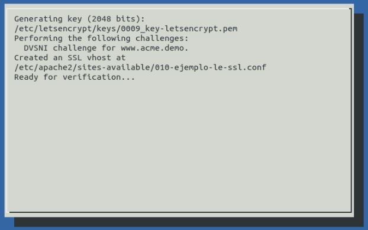
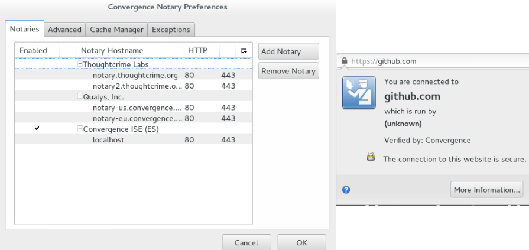

# HTTP/2

## Negociación de protocolo

* Extensión ALPN de TLS

* Realizada durante el *handshake*

* Alternativa para texto plano: campo *Upgrade*

## Cifrado oportunista

* Cifrado para `http://`

* Sin autenticación

* Servidor anuncia `h2` como 'servicio alternativo'

## Mejoras de velocidad

* Basado en SPDY:

	* *Streams* concurrentes
	
	* *Server Push*
	
* Compresión HPACK

# Let's encrypt

## ACME: Automatic Certificate Management Environment

\columnsbegin

\column{0.5\textwidth}

\column{0.5\textwidth}

1. Registro

1. Desafío

1. Expedición de certificado

\columnsend

## Boulder y LE Preview

* Boulder: servidor ACME en Go

* Let's Encrypt: cliente en Python
	* Integración con Apache
	

# Convergence

## Notarios

* Confianza distribuida

* Permite activar/desactivar notarios

* Evita *Man in the Middle*

## Cliente

* Extensión de Firefox: Convergence Extra  
